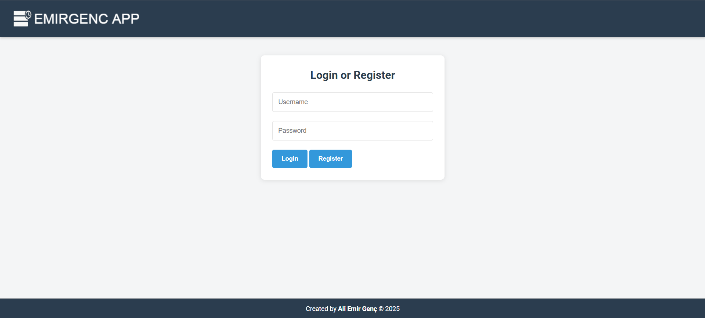

# 🧩 EMIRGENC APP – Kanban Task Manager

A modern and user-friendly **Kanban board application** built with HTML, CSS, and JavaScript.  
Users can register, log in, create tasks, assign them to departments, and move them across status columns using drag-and-drop.

---

## 🔐 Login Screen

---

## 🚀 Features

- 🔑 User registration and login (stored via localStorage)
- 📝 Task creation, editing, and deletion
- 📂 Department-based task filtering
- 📌 Task priorities and statuses:
  - To Do
  - In Progress
  - Done
- 🔔 Notification system (visual + sound alerts)
- 🖱️ Drag-and-drop functionality
- 💾 Persistent data using localStorage (offline usable)
- 🌐 Live deployment via GitHub Pages

---

## 🌍 Live Demo

🔗 [View Project Live](https://emirgenc22.github.io/kanban-app/)

---

## 🛠️ Technologies Used

- HTML5
- CSS3 (Responsive design)
- JavaScript (Vanilla)
- Font Awesome (icons)
- GitHub Pages (hosting)

---

## 📁 Folder Structure

kanban-app/
├── index.html
├── styles.css
├── script.js
├── logo.png
├── icon.ico
├── login-screen.png
└── README.md

yaml
Kopyala
Düzenle

---

## 👨‍💻 Author

**Ali Emir Genç**  
📧 `aemirgenc@stu.aydin.edu.tr`  
🔗 [GitHub Profile](https://github.com/emirgenc22)

---

## 📄 License

This project is licensed under the MIT License.
